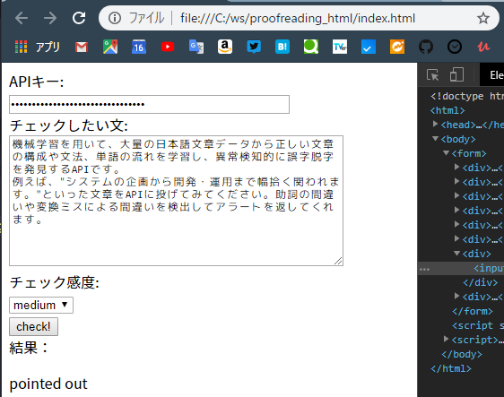

## これはなに

下記のweb APIを使用して、文章チェックを行うhtmlページです。

https://a3rt.recruit-tech.co.jp/product/proofreadingAPI/

## 必要なもの

- web APIを使用しているので、インターネットに接続している必要があります
- Web APIのページからAPIキーを取得する必要があります
- `index.html`を任意の場所に保存して、ブラウザで開きます

## 実行

- `APIキー`の欄に取得したAPIキーを入力します
  - htmlの`value=""`に書いてもOK
- チェック対象の文章を入力します
  - 最大500文字まで
  - 改行はOKだと思いますが検証していません
- チェック感度を選択します
- `check!`を押下します
- 実行後、`結果：`の下に結果が表示されます
  - **現在制作中**

### イメージ

## ブラウザについて

- `chrome 71.0.3578.98`で検証済み
